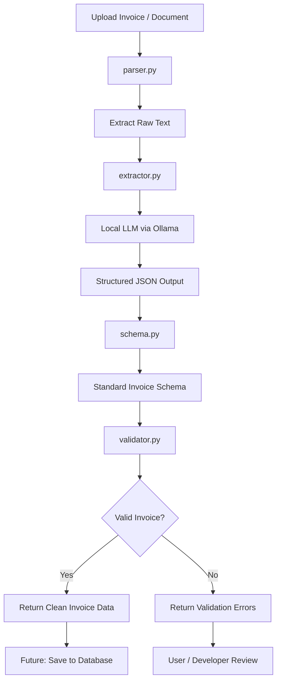
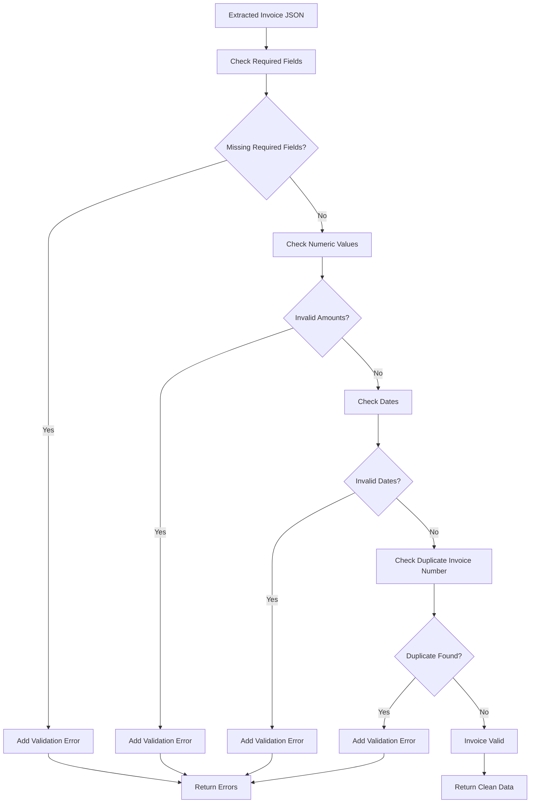

# MSME AI Copilot

A local-first AI-powered Finance & Operations Copilot designed for MSMEs to understand invoices, expenses, cash flow, inventory, and business reports using AI, analytics, and modular software architecture.

---

## Project Vision

The vision of this project is to build an intelligent business copilot that helps micro, small, and medium enterprises make better financial and operational decisions.

Many MSMEs manage business data across Excel sheets, invoices, bills, WhatsApp messages, PDFs, notebooks, and manual records. This creates confusion, delays, and poor visibility into cash flow, expenses, inventory, and business performance.

MSME AI Copilot aims to solve this by combining:

* Business analytics
* AI assistant workflows
* Local LLMs
* Retrieval-Augmented Generation
* Modular finance and operations tools
* Document intelligence

The long-term goal is to create a practical AI product that can act like a smart business analyst for small businesses.

---

## Problem Statement

MSMEs often struggle with:

* Tracking unpaid invoices
* Managing daily expenses
* Understanding cash flow
* Monitoring inventory
* Creating business reports
* Finding useful insights from scattered documents
* Making quick financial decisions

Most small business owners do not have access to expensive ERP systems or dedicated analysts. They need a simple, affordable, and intelligent assistant that can explain business data in plain language.

This project focuses on building a local-first AI copilot that helps users ask questions such as:

* Which invoices are overdue?
* How much did I spend this month?
* What is my expected cash balance?
* Which products are low in stock?
* Generate a monthly business report.
* Extract invoice data from this PDF.
* Is this invoice valid?

---

## Main Architecture Idea

```text
LLM explains.
Tools calculate.
Database stores.
RAG retrieves.
Planner coordinates.
User decides.
```

The AI should not blindly guess business numbers.
Calculations should come from tools, database queries, validators, and structured data.

---

## Project Structure

```text
msme-ai-copilot/
│
├── frontend/                  # UI dashboard and user interface
├── backend/                   # API and backend logic
│   └── document_processing/   # Invoice/document intelligence module
│       ├── parser.py          # Loads PDF, TXT, Markdown files
│       ├── extractor.py       # Uses local LLM to extract invoice JSON
│       ├── schema.py          # Standard invoice schema using Pydantic
│       ├── validator.py       # Validates extracted invoice data
│       ├── processor.py       # End-to-end document processing pipeline
│       └── sample_documents/  # Sample invoices and test documents
│
├── agents/                    # AI planner and tool routing
├── rag/                       # Retrieval-Augmented Generation pipeline
├── ml/                        # ML models, experiments, and forecasting
├── data/                      # Sample data and local datasets
├── docs/                      # Architecture notes and documentation
├── tests/                     # Unit tests and integration tests
├── scripts/                   # Utility scripts
├── config/                    # Configuration files
├── docker/                    # Docker-related setup
├── .github/workflows/         # GitHub Actions workflows
├── README.md
├── requirements.txt
└── .gitignore
```

---

# Document Processing Module

The first working module of the project is the **Document Intelligence Module**.

Its job is to take business documents such as invoices, extract useful information, structure the data into JSON, and validate it before it is used in finance tools or dashboards.

---

## Document Processing Architecture

```text
Input Document
     │
     ▼
parser.py
Extracts raw text from PDF, TXT, or Markdown
     │
     ▼
extractor.py
Sends text to local LLM using Ollama
Forces structured JSON output
     │
     ▼
schema.py
Standardizes the extracted data using Pydantic models
     │
     ▼
validator.py
Checks required fields, dates, totals, and duplicate invoice numbers
     │
     ▼
processor.py
Runs the full pipeline and returns final structured output
```

---

## Document Processing Flow Diagram



---

## Supported Document Types

Currently planned or supported:

* PDF invoices
* TXT files
* Markdown files

Future support:

* Scanned invoices using OCR
* Images
* WhatsApp-exported business records
* Excel invoices
* Supplier bills

---

# JSON Schema Example

The invoice data is standardized into a fixed schema so that the rest of the system can safely use it.

```json
{
  "invoice_number": "",
  "vendor_name": "",
  "invoice_date": "",
  "due_date": "",
  "currency": "",
  "subtotal": 0.0,
  "tax": 0.0,
  "total_amount": 0.0,
  "line_items": [
    {
      "description": "",
      "quantity": 0.0,
      "unit_price": 0.0,
      "total_price": 0.0
    }
  ],
  "payment_terms": "",
  "confidence_score": 0.0
}
```

---

## Schema Design

The schema is defined using Pydantic models.

Main fields:

* `invoice_number`
* `vendor_name`
* `invoice_date`
* `due_date`
* `currency`
* `subtotal`
* `tax`
* `total_amount`
* `line_items`
* `payment_terms`
* `confidence_score`

Line item fields:

* `description`
* `quantity`
* `unit_price`
* `total_price`

This makes the invoice data predictable, clean, and easier to validate.

---

# Sample Extraction Output

Example command:

```bash
python backend/document_processing/processor.py backend/document_processing/sample_documents/invoice_51109327.pdf
```

Example output:

```json
{
  "success": true,
  "file_path": "backend/document_processing/sample_documents/invoice_51109327.pdf",
  "data": {
    "invoice_number": "51109327",
    "vendor_name": "TechVision Distributors Pvt Ltd",
    "invoice_date": "10/09/2023",
    "due_date": "",
    "currency": "INR",
    "subtotal": 533754.0,
    "tax": 53375.4,
    "total_amount": 587129.4,
    "line_items": [
      {
        "description": "Canon EOS R50 Mirrorless Camera Body",
        "quantity": 4.0,
        "unit_price": 72698.0,
        "total_price": 290792.0
      },
      {
        "description": "Philips Hue White Ambiance Starter Kit",
        "quantity": 10.0,
        "unit_price": 24296.2,
        "total_price": 242962.0
      }
    ],
    "payment_terms": "",
    "confidence_score": 0.0
  },
  "validation_errors": []
}
```

---

# Validation System

The validator checks whether the extracted invoice data is safe and useful.

## Validation Checks

The current validation system focuses on:

* Required fields
* Numeric totals
* Valid invoice dates
* Valid due dates
* Duplicate invoice numbers
* Missing vendor names
* Invalid or empty invoice data

Required fields:

```text
invoice_number
vendor_name
invoice_date
total_amount
```

---

## Validation Flow Diagram



---

## Example Validation Error Output

```json
{
  "success": false,
  "file_path": "backend/document_processing/sample_documents/invoice_missing_vendor.pdf",
  "data": {},
  "validation_errors": [
    {
      "field": "vendor_name",
      "message": "Vendor name is required"
    },
    {
      "field": "total_amount",
      "message": "Total amount must be greater than 0"
    }
  ],
  "error": "Invoice validation failed"
}
```

---

# Features Planned

## Core Finance Features

* Invoice tracking
* Expense tracking
* Cash flow analysis
* Customer payment status
* Monthly financial summaries

## Operations Features

* Inventory tracking
* Low-stock alerts
* Product movement analysis
* Supplier and vendor records

## AI Copilot Features

* Natural language business Q&A
* AI-generated finance summaries
* AI-generated monthly reports
* Business risk explanations
* Actionable recommendations

## RAG Features

* Upload business documents
* Search invoices, bills, and notes
* Ask questions from uploaded files
* Retrieve relevant document context before answering

## Reporting Features

* Markdown reports
* CSV exports
* Future PDF/Excel report generation
* Dashboard-based insights

---

# Current Project Roadmap

## Phase 1 — Architecture and Planning

Status: In progress / mostly planned

* Define project vision
* Study MSME finance workflow
* Create system architecture
* Plan module responsibilities
* Select technology stack

## Phase 2 — Document Intelligence Module

Status: In progress

Current focus:

* Build `parser.py`
* Build `schema.py`
* Build `extractor.py`
* Build `validator.py`
* Build `processor.py`
* Test PDF invoice extraction
* Validate extracted invoice data
* Return clean structured JSON

## Phase 3 — Data Foundation

Status: Planned

* Design database schema
* Create sample invoice data
* Create sample expense data
* Create sample inventory data
* Build basic finance calculations
* Store validated invoice records

## Phase 4 — Dashboard MVP

Status: Planned

* Build Streamlit dashboard
* Add CSV upload support
* Show invoice and expense tables
* Display basic charts and summaries
* Show invoice extraction results in UI

## Phase 5 — AI Chat Integration

Status: Planned

* Connect local LLM using Ollama
* Create finance assistant prompts
* Add basic business Q&A
* Prevent AI from guessing numbers
* Route questions to finance tools

## Phase 6 — RAG System

Status: Planned

* Add document upload
* Extract text from files
* Create embeddings
* Store vectors
* Retrieve relevant context for answers
* Answer questions from uploaded documents

## Phase 7 — Agentic Workflow

Status: Planned

* Add AI planner
* Add tool-calling logic
* Route user questions to correct modules
* Generate final business recommendations
* Separate reasoning from calculations

## Phase 8 — Production Improvements

Status: Future

* Add authentication
* Add better frontend
* Add PDF/Excel report export
* Add Docker setup
* Add automated tests
* Add deployment-ready structure

---

# Tech Stack

## Programming Language

* Python

## Frontend

* Streamlit for MVP
* React or Next.js planned for future version

## Backend

* FastAPI planned for API layer

## Database

* SQLite for MVP
* PostgreSQL planned for production

## AI / LLM

* Ollama for local LLM workflow
* Open-source models such as Llama, Mistral, Gemma, or Qwen

## RAG / Vector Search

* Chroma or FAISS for vector database
* Sentence transformers or Ollama embeddings for embeddings

## Data Processing

* Pandas
* NumPy
* CSV processing
* PDF processing tools

## Reports

* Markdown reports
* CSV export
* PDF/Excel export planned

## DevOps

* GitHub
* GitHub Actions
* Docker planned

---

# Why This Project Matters

This project is not just a coding practice project. It combines business, finance, data analytics, AI, and product thinking.

It is useful for learning and demonstrating skills in:

* AI product development
* Business analytics
* Data-driven decision making
* Local AI workflows
* RAG systems
* Software architecture
* Startup-style problem solving
* Finance and operations automation
* Document intelligence

This makes the project suitable for portfolio building, internships, placement preparation, and future startup development.

---

# Screenshots

Screenshots will be added as the project UI develops.

Planned screenshots:

* Dashboard home page
* Invoice upload screen
* Expense analysis screen
* Cash flow summary
* Inventory dashboard
* AI chat assistant
* Monthly report output
* Document extraction output

---

# Demo

Demo video and live preview will be added after MVP completion.

Planned demo flow:

1. Upload invoice and expense data
2. Extract structured invoice JSON
3. Validate invoice fields
4. View finance dashboard
5. Ask AI business questions
6. Generate monthly report
7. Review cash flow and inventory insights

---

# License

This project is licensed under the MIT License.

You are free to use, modify, and distribute this project for learning and development purposes.
