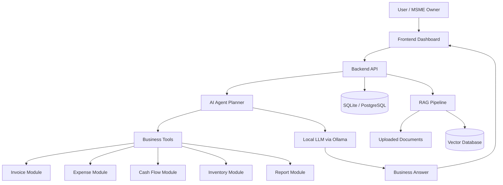

# MSME AI Copilot

A local-first AI-powered Finance & Operations Copilot designed for MSMEs to understand invoices, expenses, cash flow, inventory, and business reports using AI, analytics, and modular software architecture.

---

## Project Vision

The vision of this project is to build an intelligent business copilot that helps micro, small, and medium enterprises make better financial and operational decisions.

Many MSMEs manage business data across Excel sheets, invoices, bills, WhatsApp messages, PDFs, notebooks, and manual records. This creates confusion, delays, and poor visibility into cash flow, expenses, inventory, and business performance.

MSME AI Copilot aims to solve this by combining:

* Business analytics
* AI assistant workflows
* Local LLMs
* Retrieval-Augmented Generation
* Modular finance and operations tools

The long-term goal is to create a practical AI product that can act like a smart business analyst for small businesses.

---

## Problem Statement

MSMEs often struggle with:

* Tracking unpaid invoices
* Managing daily expenses
* Understanding cash flow
* Monitoring inventory
* Creating business reports
* Finding useful insights from scattered documents
* Making quick financial decisions

Most small business owners do not have access to expensive ERP systems or dedicated analysts. They need a simple, affordable, and intelligent assistant that can explain business data in plain language.

This project focuses on building a local-first AI copilot that helps users ask questions such as:

```text
Which invoices are overdue?
How much did I spend this month?
What is my expected cash balance?
Which products are low in stock?
Generate a monthly business report.
```

---

## Features Planned

### Core Finance Features

* Invoice tracking
* Expense tracking
* Cash flow analysis
* Customer payment status
* Monthly financial summaries

### Operations Features

* Inventory tracking
* Low-stock alerts
* Product movement analysis
* Supplier and vendor records

### AI Copilot Features

* Natural language business Q&A
* AI-generated finance summaries
* AI-generated monthly reports
* Business risk explanations
* Actionable recommendations

### RAG Features

* Upload business documents
* Search invoices, bills, and notes
* Ask questions from uploaded files
* Retrieve relevant document context before answering

### Reporting Features

* Markdown reports
* CSV exports
* Future PDF/Excel report generation
* Dashboard-based insights

---

## Architecture

The system follows a modular architecture.



### Main Architecture Idea

```text
LLM explains.
Tools calculate.
Database stores.
RAG retrieves.
Planner coordinates.
User decides.
```

---

## Project Structure

```text
msme-ai-copilot/
│
├── frontend/              # UI dashboard and user interface
├── backend/               # API and backend logic
├── agents/                # AI planner and tool routing
├── rag/                   # Retrieval-Augmented Generation pipeline
├── ml/                    # ML models, experiments, and forecasting
├── data/                  # Sample data and local datasets
├── docs/                  # Architecture notes and documentation
├── tests/                 # Unit tests and integration tests
├── scripts/               # Utility scripts
├── config/                # Configuration files
├── docker/                # Docker-related setup
├── .github/workflows/     # GitHub Actions workflows
├── README.md
├── requirements.txt
└── .gitignore
```

---

## Roadmap

### Phase 1 — Architecture and Planning

* Define project vision
* Study MSME finance workflow
* Create system architecture
* Plan module responsibilities
* Select technology stack

### Phase 2 — Data Foundation

* Design database schema
* Create sample invoice data
* Create sample expense data
* Create sample inventory data
* Build basic finance calculations

### Phase 3 — Dashboard MVP

* Build Streamlit dashboard
* Add CSV upload support
* Show invoice and expense tables
* Display basic charts and summaries

### Phase 4 — AI Chat Integration

* Connect local LLM using Ollama
* Create finance assistant prompts
* Add basic business Q&A
* Prevent AI from guessing numbers

### Phase 5 — RAG System

* Add document upload
* Extract text from files
* Create embeddings
* Store vectors
* Retrieve relevant context for answers

### Phase 6 — Agentic Workflow

* Add AI planner
* Add tool-calling logic
* Route user questions to correct modules
* Generate final business recommendations

### Phase 7 — Production Improvements

* Add authentication
* Add better frontend
* Add PDF/Excel report export
* Add Docker setup
* Add automated tests
* Add deployment-ready structure

---

## Screenshots

Screenshots will be added as the project UI develops.

Planned screenshots:

* Dashboard home page
* Invoice upload screen
* Expense analysis screen
* Cash flow summary
* Inventory dashboard
* AI chat assistant
* Monthly report output

---

## Demo

Demo video and live preview will be added after MVP completion.

Planned demo flow:

1. Upload invoice and expense data
2. View finance dashboard
3. Ask AI business questions
4. Generate monthly report
5. Review cash flow and inventory insights

---

## Tech Stack

### Programming Language

* Python

### Frontend

* Streamlit for MVP
* React or Next.js planned for future version

### Backend

* FastAPI planned for API layer

### Database

* SQLite for MVP
* PostgreSQL planned for production

### AI / LLM

* Ollama for local LLM workflow
* Open-source models such as Llama, Mistral, Gemma, or Qwen

### RAG / Vector Search

* Chroma or FAISS for vector database
* Sentence transformers or Ollama embeddings for embeddings

### Data Processing

* Pandas
* NumPy
* CSV and PDF processing tools

### Reports

* Markdown reports
* CSV export
* PDF/Excel export planned

### DevOps

* GitHub
* GitHub Actions
* Docker planned

---

## Why This Project Matters

This project is not just a coding practice project. It combines business, finance, data analytics, AI, and product thinking.

It is useful for learning and demonstrating skills in:

* AI product development
* Business analytics
* Data-driven decision making
* Local AI workflows
* RAG systems
* Software architecture
* Startup-style problem solving

This makes the project suitable for portfolio building, internships, placement preparation, and future startup development.

---

## License

This project is licensed under the MIT License.

You are free to use, modify, and distribute this project for learning and development purposes.
